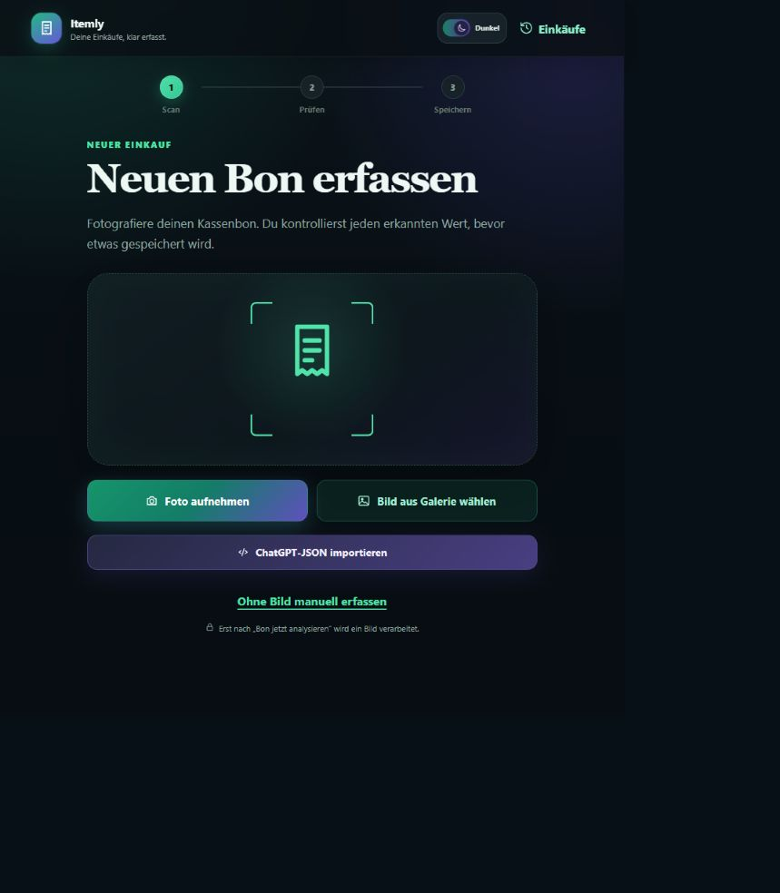

# Itemly – Receipt Tracker

[](https://github.com/Kamitoad/itemly/actions/workflows/ci.yml)
[](LICENSE)

> Kassenbons privat erfassen, nachvollziehbar prüfen und lokal speichern.

Itemly ist eine mobile, selbst gehostete Web-App für strukturierte Einkaufsdaten. Bonbilder und Daten bleiben standardmäßig auf dem eigenen Rechner. Die Erfassung funktioniert vollständig manuell, über einen kostenlosen Copy-and-paste-Workflow mit einem normalen ChatGPT-Chat oder optional über einen selbst konfigurierten, OpenAI-kompatiblen API-Anbieter.



## Warum Itemly?

Kassenbon-Apps sind häufig an ein Konto, eine Cloud oder ein kostenpflichtiges KI-Angebot gebunden. Itemly verfolgt einen anderen Ansatz:

- **Local first:** SQLite-Datenbank und Originalbilder liegen im lokalen Datenverzeichnis.
- **Ohne laufende KI-Kosten nutzbar:** Manuelle Erfassung und ChatGPT-JSON-Import benötigen keinen API-Schlüssel.
- **Kontrolle vor dem Speichern:** Erkannte Angaben gelten als ungeprüft, bis der Benutzer sie kontrolliert.
- **Nachvollziehbare Beträge:** Gedruckte Werte bleiben erhalten; Differenzen werden angezeigt und nicht stillschweigend korrigiert.
- **Austauschbare Anbindungen:** Extraktion, Dateispeicher und Persistenz sind voneinander getrennt.

## Funktionsumfang von v0.1.0

- Kamera- und Galerieauswahl mit Vorschau und ausdrücklicher Zustimmung vor externer Verarbeitung
- validierter JSON-Import aus einem normalen ChatGPT-Chat
- vollständig manueller Ablauf ohne KI-Zugang
- Bearbeitung von Händler-, Artikel-, Zahlungs- und Summendaten
- Kennzeichnung unsicher erkannter Artikel und Felder
- rechnerischer Abgleich von Positionen, Rabatten, Steuern, Pfand und Gebühren
- Entwürfe sowie atomar und idempotent gespeicherte, ausgeglichene Einkäufe
- lokaler Verlauf mit Suche und Detailansicht
- Einzel-Export, portabler Export samt Originalbild und vollständiges Backup
- installierbare PWA mit hellem und dunklem Farbschema

## Schnellstart

Voraussetzungen:

- Node.js 24 oder neuer
- pnpm 11.24.0

```sh
pnpm install
pnpm dev
```

Danach stehen zur Verfügung:

- Entwicklungsoberfläche: `http://localhost:5173`
- API: `http://localhost:8787`

Für Tests auf einem Smartphone im selben WLAN wird die vom Entwicklungsserver angezeigte Netzwerkadresse verwendet, beispielsweise `http://192.168.1.10:5173`.

## Produktionsbetrieb

```sh
pnpm build
pnpm start
```

Anschließend läuft die vollständige App unter `http://localhost:8787`.

Itemly v0.1.0 besitzt keine Benutzerkonten oder Zugriffskontrolle. Der Server ist deshalb für den privaten Rechner beziehungsweise ein vertrauenswürdiges Heimnetz gedacht und sollte nicht ohne vorgeschaltete Absicherung öffentlich ins Internet gestellt werden.

## Erfassung ohne API-Schlüssel

1. In Itemly **ChatGPT-JSON importieren** auswählen.
2. Die bereitgestellte Vorlage kopieren.
3. Vorlage und Bonbild in einem normalen ChatGPT-Chat senden.
4. Den zurückgegebenen JSON-Block in Itemly einfügen.
5. Alle Angaben kontrollieren und erst danach speichern.

Dieser Ablauf verwendet keine KI-API innerhalb von Itemly. Das Hochladen des Bildes in ChatGPT ist eine separate, bewusste Handlung. Typische Kopierartefakte werden repariert; die Daten werden trotzdem vollständig validiert und niemals automatisch bestätigt.

## Optionale API-Konfiguration

`.env.example` kann nach `.env` kopiert und angepasst werden:

```dotenv
OPENAI_API_KEY=
OPENAI_MODEL=gpt-4.1-mini
OPENAI_BASE_URL=https://api.openai.com/v1
```

Der Schlüssel bleibt auf dem Server und wird nicht an den Browser ausgeliefert. Ein Bonbild wird nur nach einem ausdrücklichen Hinweis an den konfigurierten Anbieter gesendet. Ohne Schlüssel bleibt die App vollständig manuell und per ChatGPT-JSON nutzbar.

## Lokale Daten und Backups

Standardmäßig verwendet Itemly `./data`:

- `receipts.sqlite` – relationale SQLite-Datenbank
- `receipts/` – inhaltsadressierte Originalbilder

Der gesamte Ordner sowie `.env` sind von Git ausgeschlossen. Ein vollständiges Backup kann in der Einkaufsübersicht oder über `GET /api/backup` heruntergeladen werden.

Wiederherstellung:

```sh
pnpm restore <backup.json> <leeres-zielverzeichnis>
```

Danach `DATA_DIR` auf das Zielverzeichnis setzen, Itemly starten und mindestens einen Einkauf samt Bild kontrollieren.

## Qualitätsprüfungen

```sh
pnpm check
pnpm build
```

Die Tests decken unter anderem Schema-Validierung, Betragsrechnung, Rabatte, Steuern, Gebühren, Unsicherheiten, Duplikaterkennung, Idempotenz, Transaktionen, Backups und Extraktionsfehler ab. Dieselben Prüfungen laufen bei Pushes und Pull Requests in GitHub Actions.

## Architektur

Eine kompakte Übersicht über Client, API, Datenmodell und Sicherheitsgrenzen steht in [docs/ARCHITECTURE.md](docs/ARCHITECTURE.md).

## Datenschutz und Sicherheit

- [Datenschutz und Datenfluss](PRIVACY.md)
- [Sicherheitsrichtlinie](SECURITY.md)
- [Beitragen](CONTRIBUTING.md)
- [Änderungsverlauf](CHANGELOG.md)

## Geplanter Ausbau

- verständliche Detailansicht für jedes unsichere Feld
- Bearbeitung bereits gespeicherter Einkäufe
- komfortabler Editor für Gebühren, Pfand und Rabatte
- CSV-Auswertungen und Statistiken
- optionale, austauschbare Backup-Ziele

## Lizenz

Der Quellcode steht unter der [MIT-Lizenz](LICENSE) © 2026 Chasan Moustafa.
